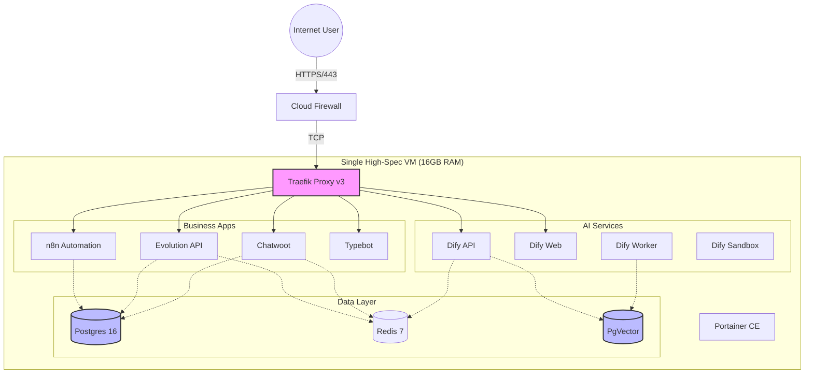
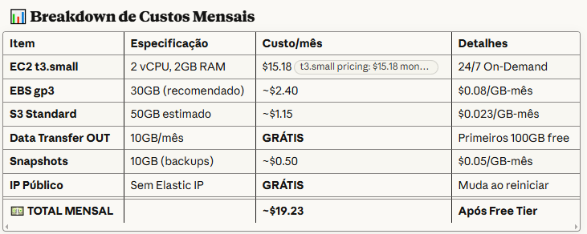
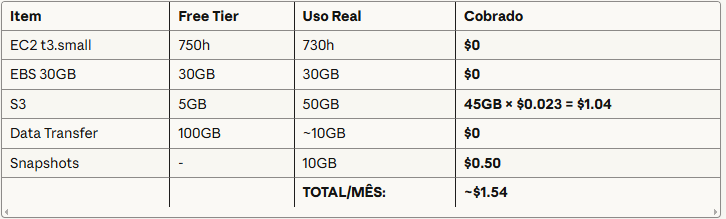
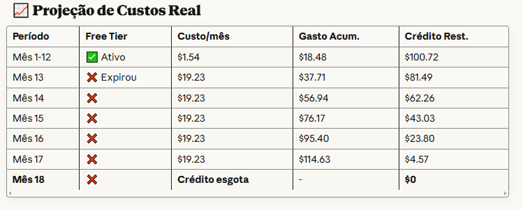
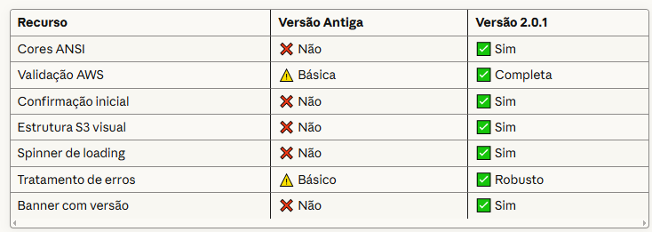

<!--
 alobexpress-setup (c) by Jonatan Renan
 
 alobexpress-setup is licensed under a
 Creative Commons Attribution 4.0 International License.
-->

<p align="center">
  <a href="" rel="noopener">
 </a>
</p>

<h2 align="center">INFRAESTRUTURA ALOB EXPRESS (MULTI-CLOUD) v2.0.1</h2>
<h3 align="center">AWS & Google Cloud | Docker Swarm | N8N | Traefik | Portainer | Evolution API | Dify AI</h3>

<div align="center">

[]()
[]()
[](/LICENSE)

</div>

---

<p align="center"> 🤖 Infraestrutura como Código (IaC) moderna e unificada para automação de alta performance. 🤖
    <br> 
</p>

# 📋 Índice

- [Visão Geral e Arquitetura](#-visão-geral-e-arquitetura)
- [Preparação da Nuvem (Passo a Passo)](#-preparação-da-nuvem)
  - [Opção A: Amazon AWS](#opção-a-amazon-aws)
  - [Opção B: Google Cloud Platform (GCP)](#opção-b-google-cloud-platform-gcp)
- [Instalação Automatizada](#-instalação-automatizada)
- [Pós-Instalação e Configuração](#-pós-instalação-e-configuração)
  - [Localização dos Arquivos de Configuração](#-localização-dos-arquivos-de-configuração)
  - [DNS (Cloudflare)](#dns-cloudflare)
  - [Banco de Dados N8N](#criar-banco-de-dados-n8n-obrigatório)
  - [CORS (Evolution API)](#-configurar-cors-para-evolution-api)
- [Custos e Otimização Financeira](#-custos-e-otimização)
- [Segurança e Backups Automáticos](#-segurança-e-manutenção)
- [Otimização Automática de Recursos (80/20)](#-otimização-automática-de-recursos)
- [📘 Guia Prático de DevOps (Docker & Cloud)](#-guia-prático-de-devops-docker--cloud)
  - [Comandos Essenciais](#comandos-essenciais)
  - [Transferência de Arquivos](#transferência-de-arquivos-uploaddownload)
  - [Logs e Monitoramento Avançado](#logs-e-monitoramento-avançado)
- [Instalação Standalone do Dify (Híbrido)](#-instalação-standalone-do-dify-híbrido)
- [Troubleshooting](#-troubleshooting)

---

# 🏗 Visão Geral e Arquitetura

Este projeto utiliza **Docker Swarm** para orquestrar contêineres de forma resiliente e escalável, suportando tanto **AWS** quanto **Google Cloud**.

### Diagrama de Infraestrutura



---

# ☁ Preparação da Nuvem

Escolha seu provedor de nuvem e siga os passos detalhados de preparação.

## Opção A: Amazon AWS

### 1. Criar Bucket S3 (Para Backups e Evolution API)
1. Acesse: [S3 Console](https://s3.console.aws.amazon.com/s3/)
2. **Create bucket** (Crie DOIS buckets separados):
   
   #### A. Bucket de Mídia (Público) - Para Evolution API
   - **Nome Sugerido**: `alobexpress-evolution-media-2025` (ou similar)
   - **Configuração de Bloqueio Público**:
     - ⬜ Desmarque "Block all public access" (Bloquear todo acesso público).
     - Confirme que você entende os riscos (é necessário para o WhatsApp baixar as mídias).
   
   - **Bucket Policy (Leitura Pública Obrigatória)**:
     1. Vá na aba **Permissions** > **Bucket policy** > **Edit**.
     2. Cole o JSON abaixo (troque `SEU_BUCKET_DE_MIDIA` pelo nome real):
     ```json
     {
         "Version": "2012-10-17",
         "Statement": [
             {
                 "Effect": "Allow",
                 "Principal": "*",
                 "Action": "s3:GetObject",
                 "Resource": "arn:aws:s3:::SEU_BUCKET_DE_MIDIA/*"
             }
         ]
     }
     ```

   - **CORS (Cross-origin resource sharing)**:
     1. Ainda na aba **Permissions**, role até o final em **CORS** > **Edit**.
     2. Cole o JSON abaixo (Permite que o navegador/WhatsApp baixe os arquivos):
     ```json
     [
         {
             "AllowedHeaders": ["*"],
             "AllowedMethods": ["GET", "HEAD"],
             "AllowedOrigins": ["*"],
             "ExposeHeaders": []
         }
     ]
     ```

   #### B. Bucket de Backup e Dify (Privado)
   - **Nome Sugerido**: `alobexpress-storage-2025` (ou similar)
   - **Configuração de Bloqueio Público**:
     - ✅ **Marque a opção "Block all public access"** (Bloquear todo acesso público).
     - Isso garante que seus backups e arquivos do Dify (RAG) não fiquem expostos na internet.
   - **Bucket Policy (Acesso Restrito ao Root/IAM)**:
     ```json
     {
         "Version": "2012-10-17",
         "Statement": [
             {
                 "Sid": "PermissaoRestrita",
                 "Effect": "Allow",
                 "Principal": { "AWS": "arn:aws:iam::SEU_ACCOUNT_ID:root" },
                 "Action": [
                     "s3:PutObject",
                     "s3:GetObject",
                     "s3:ListBucket"
                 ],
                 "Resource": [
                     "arn:aws:s3:::SEU_BUCKET_DE_BACKUP",
                     "arn:aws:s3:::SEU_BUCKET_DE_BACKUP/*"
                 ]
             }
         ]
     }
     ```
     - Ative o Versionamento (Versioning).
     - Crie uma Lifecycle Rule para expirar arquivos antigos após 30/90 dias.
3. **Região**: `us-east-1` (Recomendado).


### 2. Criar Usuário IAM
1. Acesse IAM > Users > Create user.
2. Nome: `seu_negocio-user`.
3. Permissões: `AmazonS3FullAccess`.
4. **Crie Access Keys** e SALVE-AS.

### 3. Criar Instância EC2
1. **Imagem (AMI)**: `Ubuntu Server 22.04 LTS`.
2. **Tipo**: `t3.large` (Recomendado para stack completa) ou `t3.small` (apenas N8N/Evolution).
3. **Storage**: 80GB gp3.
4. **Security Group**:
   - Permitir **SSH (22)** do seu IP.
   - Permitir **HTTP (80)** de 0.0.0.0/0.
   - Permitir **HTTPS (443)** de 0.0.0.0/0.

## Opção B: Google Cloud Platform (GCP) - Recomendado

### 1. Criar Compute Engine (VM)
1. **Região**: `us-central1` (Iowa) ou `us-east1`.
2. **Máquina**: `e2-standard-4` (4 vCPU, 16GB RAM) para stack completa (com Dify).
3. **Disco de Inicialização**:
   - Imagem: `Debian GNU/Linux 12 (bookworm)` ou `Ubuntu 22.04 LTS`.
   - Tamanho: 80GB SSD Persistente.
4. **Firewall**:
   - ✅ Permitir tráfego HTTP.
   - ✅ Permitir tráfego HTTPS.

---

# 🚀 Instalação Automatizada

O script modular `install.sh` orquestra a instalação e detecta o ambiente para ambos os provedores.

### 1. Conectar na VM
```bash
# AWS
ssh -i "sua-chave.pem" ubuntu@seu-ip-publico

# GCP (via Console ou Terminal)
gcloud compute ssh --zone "us-central1-a" "nome-da-vm"
```

### 2. Instalação Rápida (Recomendada)
O comando abaixo baixa o instalador e todos os módulos necessários automaticamente:

```bash
curl -sL https://raw.githubusercontent.com/Renanvt/infra-cloud-aws-google/main/install.sh | sudo bash
```

### 3. Instalação Manual (Git)
Se preferir clonar o repositório completo:

```bash
# 1. Clone o repositório
git clone https://github.com/Renanvt/infra-cloud-aws-google.git infra-alob
cd infra-alob

# 2. Dê permissão de execução
chmod +x install.sh

# 3. Execute o instalador
sudo ./install.sh
```

### 4. Instalação Manual (Upload)
Se preferir enviar os arquivos manualmente:

```bash
# Compacte o projeto na sua máquina local
tar -czvf infra.tar.gz install.sh modules/

# Envie para o servidor
scp infra.tar.gz ubuntu@SEU_IP:/home/ubuntu/

# No servidor:
tar -xzvf infra.tar.gz
chmod +x install.sh
sudo ./install.sh
```

---

# ⚙ Pós-Instalação e Configuração

## 📂 Localização dos Arquivos de Configuração
Os arquivos de configuração `.yaml` (Docker Compose) e `.env` são gerados e salvos automaticamente no diretório do negócio:
`/opt/infra/<NOME_DO_NEGOCIO>/`

## DNS (Cloudflare)
Configure seus apontamentos DNS no Cloudflare apontando para o **IP Público** da sua VM.
**Use "DNS Only" (Nuvem Cinza) inicialmente para garantir a geração dos certificados SSL.**

| Tipo | Nome | Destino | Comentário |
|------|------|----------|------------|
| **A** | `automations` | `SEU_IP_VM` | Apontamento Principal |
| **CNAME** | `painel` | `automations.meu-dominio.com` | Portainer |
| **CNAME** | `n8n` | `automations.meu-dominio.com` | N8N Editor |
| **CNAME** | `evolution` | `automations.meu-dominio.com` | Evolution API |
| **CNAME** | `dify` | `automations.meu-dominio.com` | Dify Web |
| **CNAME** | `api` | `automations.meu-dominio.com` | Dify API |

## Criar Banco de Dados N8N (Obrigatório)
O N8N precisa que o banco de dados seja criado manualmente no primeiro uso (se o script não conseguir).

1. Acesse o **Portainer** (`https://painel.seu-dominio.com`).
2. Vá em **Containers** > Encontre o `postgres`.
3. Clique no ícone **>_ Console** > **Connect**.
4. Execute: `psql -U postgres -c "CREATE DATABASE n8n;"`

## 🛡️ Configurar CORS (para Evolution API)
*Já coberto na seção [Preparação da Nuvem](#1-criar-bucket-s3-para-backups-e-evolution-api).*
Certifique-se de que o **Bucket de Mídia** possui a configuração de CORS permitindo `GET` e `HEAD` para funcionar corretamente com o WhatsApp e Navegadores.


# 🛠 Operações Avançadas (AWS)

## Como Expandir Volume AWS

1. No Console AWS > Volumes > Modify Volume > Aumente o tamanho.
2. Na VM:
   ```bash
   # Listar discos
   lsblk
   
   # Expandir partição
   sudo growpart /dev/nvme0n1 1
   
   # Redimensionar sistema de arquivos
   sudo resize2fs /dev/nvme0n1p1
   ```

## Como Atachar Volume EBS
Se você precisar de um segundo disco (`/data`):

1. Crie o volume na mesma Zona de Disponibilidade (AZ).
2. Attach volume à instância.
3. Na VM:
   ```bash
   # Formatar (apenas se for novo!)
   sudo mkfs -t ext4 /dev/xvdf

   # Montar
   sudo mkdir /data
   sudo mount /dev/xvdf /data
   
   # Persistir no fstab (Cuidado!)
   # UUID=... /data ext4 defaults,nofail 0 2
   ```


---

# 💰 Custos e Otimização

## AWS (Free Tier & Projeções)
*   **EC2 (t3.small)**: ~$15-20/mês (Básico).
*   **EC2 (t3.large)**: ~$60-70/mês (Stack Completa).
*   **EBS (80GB)**: ~$8/mês.

### Breakdown de Custos Mensais AWS



### Projeção de Custos Real


## Google Cloud (Estimativas)
*   **VM Principal (e2-standard-4)**: ~$105,84/mês (Alta performance, 16GB RAM).
*   **VM Média (e2-standard-2)**: ~$57,42/mês (8GB RAM).

### Otimizações
1.  **S3 Lifecycle (Automação de Custos)**:
    Para reduzir custos, configure o S3 para mover backups antigos para "Glacier" (armazenamento frio/barato) e apagar após 90 dias.
    
    1. Crie um arquivo chamado `s3-lifecycle.json` com o conteúdo abaixo:
    ```json
    {
        "Rules": [
            {
                "ID": "MoveToGlacierAndExpire",
                "Prefix": "backups/",
                "Status": "Enabled",
                "Transitions": [
                    {
                        "Days": 30,
                        "StorageClass": "GLACIER"
                    }
                ],
                "Expiration": {
                    "Days": 90
                }
            }
        ]
    }
    ```
    
    2. Aplique a regra no seu bucket de backup:
    ```bash
    aws s3api put-bucket-lifecycle-configuration --bucket NOME_DO_BUCKET_BACKUP --lifecycle-configuration file://s3-lifecycle.json
    ```

2.  **N8N Pruning**: O script já configura limpeza automática de execuções antigas (72h) para economizar disco.

## Sistema de Backups Automáticos (S3)

O sistema inclui scripts para realizar backups completos (Banco de Dados + Volumes) e enviá-los para um Bucket S3 da AWS.

### 1. Requisitos no S3
1. Crie um Bucket S3 (ex: `alobexpress-storage-2025`).
2. **Importante**: Crie uma pasta chamada `backups/` (no plural) dentro deste bucket. O script espera encontrar esta pasta.

### 2. Permissões AWS
Certifique-se de que as permissões foram configuradas conforme a [Seção de Preparação](#1-criar-bucket-s3-para-backups-e-evolution-api).

Se você optou por criar um **Usuário IAM Dedicado** (em vez de usar a Bucket Policy no root), adicione esta política ao usuário:
```json
{
    "Version": "2012-10-17",
    "Statement": [
        {
            "Sid": "PermissaoBackupS3",
            "Effect": "Allow",
            "Action": [
                "s3:PutObject",
                "s3:ListBucket"
            ],
            "Resource": [
                "arn:aws:s3:::alobexpress-storage-2025",
                "arn:aws:s3:::alobexpress-storage-2025/backups/*"
            ]
        }
    ]
}
```

### 3. O que é salvo?
O script `backup_to_s3.sh` realiza o backup de todos os componentes críticos:
*   **N8N**: Todos os fluxos, credenciais e histórico (via Dump do Postgres).
*   **Dify**: Base de conhecimento (Vector Store), fluxos e configurações (via Dump do Postgres + PgVector).
*   **Evolution API**: Instâncias e sessões (via Volume `evolution_v2_data`).
*   **Infra**: Certificados SSL (Traefik) e dados do Portainer.

**Nota sobre o Arquivo de Backup (.tar.gz):**
O arquivo gerado no S3 possui a extensão `.tar.gz`. Se você baixar e extrair este arquivo no Windows, ele pode aparecer como uma pasta com o mesmo nome do arquivo (ex: `backup_20251231_144856`). Dentro desta pasta, você encontrará os arquivos SQL e pastas de volume. Isso é normal e esperado.

### 4. Executando o Backup

#### Opção A: Backup para S3 (Recomendado)
**Execução Manual:**
```bash
# Execute e siga as instruções interativas
./backup_to_s3.sh
```

**Instalação Rápida (Curl):**
Se o arquivo não existir (nova VM), baixe e execute diretamente:
```bash
curl -sL "https://setup.alobexpress.com.br/backup_to_s3.sh" -o backup_to_s3.sh
chmod +x backup_to_s3.sh
sudo ./backup_to_s3.sh
```

**Automação (Cron):**
Para rodar todo dia às 03:00am, adicione ao crontab (`crontab -e`):
```bash
0 3 * * * S3_BUCKET=alobexpress-storage-2025 S3_REGION=us-east-1 S3_ACCESS_KEY=SUA_KEY S3_SECRET_KEY=SUA_SECRET /opt/infra/NOME_DO_NEGOCIO/backup_to_s3.sh >> /var/log/backup_s3.log 2>&1
```

#### Opção B: Backup Local (VM)
Ideal para snapshots rápidos antes de mudanças. O script salva localmente e gerencia rotação (padrão: 7 dias).

**Instalação Rápida (Curl):**
```bash
curl -sL "https://setup.alobexpress.com.br/backup_to_vm.sh" -o backup_to_vm.sh
chmod +x backup_to_vm.sh
sudo ./backup_to_vm.sh
```

**Variáveis Opcionais:**
Você pode definir o diretório e retenção:
```bash
BACKUP_ROOT_DIR=/meus/backups RETENTION_DAYS=15 ./backup_to_vm.sh
```

### 5. Restaurando Backup (Disaster Recovery)

Se você precisar restaurar um backup (ex: migração de servidor ou recuperação de desastre), use o script `restore_from_s3.sh`.

1. **Baixe e execute o script**:
   ```bash
   # Se o repositório já estiver clonado:
   sudo ./restore_from_s3.sh
   
   # Ou baixe e execute diretamente (em nova VM):
   curl -fsSL https://raw.githubusercontent.com/alob-express/infra-alob-express/main/restore_from_s3.sh -o restore_from_s3.sh
   chmod +x restore_from_s3.sh
   sudo ./restore_from_s3.sh
   ```

2. **Siga o assistente**:
   - O script pedirá suas credenciais S3.
   - Listará os backups disponíveis.
   - Baixará e restaurará automaticamente Volumes e Banco de Dados.

> **Nota**: O script gerencia a parada/início da stack se necessário para garantir a integridade dos dados.

# ⚡ Otimização Automática de Recursos

O sistema aplica a regra de ouro de **80/20** para evitar travamentos e garantir estabilidade sob alta carga:

*   **Limite Máximo (Limits)**: Containers podem usar até 80% da RAM total disponível.
*   **Reserva Garantida (Requests)**: 10% reservado para serviços críticos (Garantia de QoS).

**Dify AI (SLA)**: Para o Dify, garantimos 2 vCPUs e 4GB de RAM dedicados para evitar queda de conexões durante processamento de vetores.

### Monitoramento em Tempo Real (DevOps)
Para verificar se a alocação de recursos está adequada:

```bash
# Ver consumo de CPU/RAM em tempo real
docker stats --format "table {{.Name}}\t{{.CPUPerc}}\t{{.MemUsage}}\t{{.MemPerc}}"

# Verificar limites definidos
docker inspect NOME_CONTAINER --format '{{.HostConfig.Memory}}'
```

---


# 📘 Guia Prático de DevOps (Docker & Cloud)

Esta seção contém comandos e procedimentos essenciais para o dia a dia.

## Comandos Essenciais

### Gestão de Stacks (Serviços)
```bash
# Listar serviços rodando
docker service ls

# Ver logs de um serviço (tempo real)
docker service logs -f NOME_SERVICO

# Reiniciar um serviço (forçar update)
docker service update --force NOME_SERVICO
```

### Gestão de Containers Individuais
```bash
# Listar todos (inclusive parados)
docker ps -a

# Ver logs de um container específico
docker logs --tail 100 -f NOME_CONTAINER

# Entrar no terminal do container
docker exec -it NOME_CONTAINER /bin/sh
```

### Manutenção Completa (Parar/Iniciar)

**Parar tudo com segurança:**
```bash
docker stack rm traefik portainer postgres redis rabbitmq n8n_editor n8n_worker n8n_webhook evolution_v2 dify_pgvector dify_sandbox dify_api dify_web dify_worker
```

**Iniciar tudo:**
```bash
# 1. Infra
docker stack deploy -c infra/04.traefik.yaml traefik
docker stack deploy -c infra/05.portainer.yaml portainer
docker stack deploy -c infra/06.postgres.yaml postgres
docker stack deploy -c infra/07.redis.yaml redis
docker stack deploy -c infra/11.rabbitmq.yaml rabbitmq

# 2. Apps
docker stack deploy -c infra/08.n8n-editor.yaml n8n_editor
docker stack deploy -c infra/18.evolution_v2.yaml evolution_v2
# ... (demais serviços)
```

## Transferência de Arquivos (Upload/Download)

### Baixar da VM para seu PC
**Método via Navegador (SSH GCP):**
1. Na VM: `sudo tar -czf /tmp/backup.tar.gz /caminho/da/pasta`
2. No SSH do Navegador: Clique na engrenagem ⚙️ > **Download file** > Digite `/tmp/backup.tar.gz`.

**Método via Terminal (gcloud):**
```bash
gcloud compute scp INSTANCIA:/tmp/backup.tar.gz ~/Downloads/ --zone=us-central1-a
```

### Enviar do PC para a VM
```bash
gcloud compute scp ~/Downloads/arquivo.txt INSTANCIA:/tmp/ --zone=us-central1-a
```


## 🔄 Guia de Restauração de Backup (S3)

Se você precisa restaurar dados de um backup anterior, siga este checklist rigoroso para garantir a integridade dos dados.

### ✅ Checklist Pré-Restauração

**1. Pré-requisitos de Acesso:**
Certifique-se de que você consegue acessar as URLs dos serviços (mesmo que vazios):
- [ ] Portainer: `https://${PORTAINER_DOMAIN}`
- [ ] N8N Editor: `https://${N8N_EDITOR_DOMAIN}`
- [ ] RabbitMQ: `https://${RABBITMQ_DOMAIN}`
- [ ] Evolution API: `https://${EVOLUTION_DOMAIN}`
- [ ] Dify (se instalado): `https://${DIFY_WEB_DOMAIN}`

**2. Tempo de Estabilização:**
- [ ] Aguarde pelo menos **5 minutos** após o início dos containers.
  - *Motivo:* O Postgres precisa inicializar o banco e rodar migrations iniciais antes de aceitar sobrescrita de dados.

**3. Status dos Serviços:**
- [ ] Verifique no Portainer se todos os containers estão com status `running` ou `healthy`.
- [ ] Não inicie a restauração se houver containers em `restarting`.

### 🚀 Executando a Restauração

**Opção A: Durante o Setup**
O script de instalação perguntará ao final se deseja restaurar. Responda `sim` e siga o assistente.

**Opção B: Manualmente (Pós-instalação)**
```bash
cd /opt/infra/NOME_DO_NEGOCIO
sudo ./restore_from_s3.sh
```

### ⏳ Pós-Restauração

1. O script pode solicitar a reinicialização da stack.
2. Após o término, **aguarde novamente 2 a 5 minutos** para que os serviços carreguem os dados restaurados do disco para a memória.
3. Valide se seus fluxos (N8N), instâncias (Evolution) e dados (Dify) reapareceram.

---

## Logs e Monitoramento Avançado

### Ver logs de TODOS os containers rodando (Script Rápido)
```bash
for container in $(docker ps --format '{{.Names}}'); do 
    echo "=== Logs de $container ===" 
    docker logs --tail 50 $container 
    echo "" 
done
```

### 🧹 Limpeza Segura de Disco (Best Practices)

Evite usar `docker system prune -a --volumes` cegamente, pois isso apaga dados persistentes! Use os comandos abaixo:

#### 1. Diagnóstico
```bash
# Ver quanto espaço você vai liberar (SEM apagar nada)
docker system df

# Ver espaço em disco do sistema
df -h
```

#### 2. Limpeza Segura (Sem perda de dados)
```bash
# Limpar apenas containers parados
docker container prune

# Limpar apenas imagens "dangling" (imagens quebradas/sem tag)
docker image prune

# Limpar redes não usadas
docker network prune

# Limpar todas imagens não usadas (MANTÉM volumes/dados)
docker system prune -a
```

#### 3. Gestão de Volumes (Cuidado!)
```bash
# Listar todos os volumes
docker volume ls

# Ver onde o volume está sendo usado
docker ps -a --filter volume=NOME_DO_VOLUME

# Backup de volume (Exemplo)
docker run --rm -v NOME_VOLUME:/data -v $(pwd):/backup alpine tar czf /backup/volume-backup.tar.gz /data
```

> **Recomendação**: Use `docker system prune -a` para limpeza geral. Isso limpa containers parados, imagens não usadas e redes, mas **MANTÉM seus volumes e bancos de dados intactos**.

---

# 🤖 Instalação Standalone do Dify (Híbrido)

Para rodar o Dify em uma VM separada (Híbrido: AWS <-> GCP), use o script dedicado:

```bash
curl -sL https://setup.alobexpress.com.br/setup_dify.sh | sudo bash
```

Siga o assistente interativo para configurar a integração de rede entre as duas VMs.

---

# 🚨 Troubleshooting

### Container reiniciando (Loop)
1. Verifique os logs: `docker logs --tail 50 NOME_CONTAINER`
2. Geralmente é falta de memória (OOM Kill) ou erro de conexão com banco.
3. Se for memória, ajuste os limites no arquivo YAML correspondente em `vm/`.

### "Port is missing" no Traefik
Certifique-se de que o serviço tem a porta definida nos labels ou no `loadbalancer.server.port`.

### Erro S3 "ENOTFOUND"
Verifique se o endpoint do S3 está sem `https://`. O Evolution V2 requer apenas o hostname (ex: `s3.us-east-1.amazonaws.com`).

---
</a>

**Versão**: 2.0.1 | **Atualizado**: Dezembro 2025
