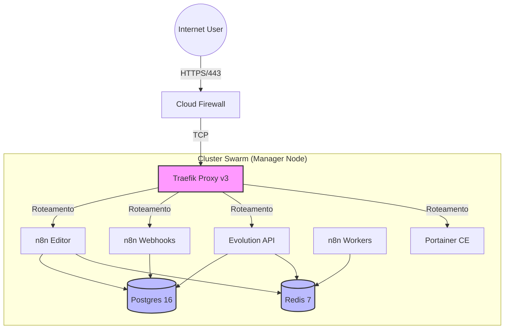

<!--
 alobexpress-setup (c) by Jonatan Renan
 
 alobexpress-setup is licensed under a
 Creative Commons Attribution 4.0 International License.
-->

<p align="center">
  <a href="" rel="noopener">
 </a>
</p>

<h2 align="center">INFRAESTRUTURA ALOB EXPRESS (MULTI-CLOUD) v3.1.0</h2>
<h3 align="center">AWS & Google Cloud | Docker Swarm | N8N | Traefik | Portainer</h3>

<div align="center">

[]()
[]()
[](/LICENSE)

</div>

---

<p align="center"> 🤖 Infraestrutura como Código (IaC) moderna e unificada para automação de alta performance. 🤖
    <br> 
</p>

# 📋 Índice

- [Visão Geral e Arquitetura](#-visão-geral-e-arquitetura)
- [Preparação da Nuvem (Escolha a sua)](#-preparação-da-nuvem)
  - [Opção A: Amazon AWS](#opção-a-amazon-aws)
  - [Opção B: Google Cloud Platform (GCP)](#opção-b-google-cloud-platform-gcp)
- [Instalação Automatizada](#-instalação-automatizada)
- [Pós-Instalação e Configuração](#-pós-instalação-e-configuração)
  - [DNS (Cloudflare)](#dns-cloudflare)
  - [Criar Banco de Dados N8N](#criar-banco-de-dados-n8n-obrigatório)
  - [Configurar CORS (Evolution API)](#-configurar-cors-para-evolution-api)
- [Stack Tecnológica](#-stack-tecnológica)
- [Custos e Otimização](#-custos-e-otimização)
  - [AWS (Free Tier & Projeções)](#aws-free-tier--projeções)
  - [Google Cloud (Estimativas)](#google-cloud-estimativas)
  - [Otimizações para Maximizar o Tempo](#-otimizações-para-maximizar-o-tempo)
- [Segurança e Manutenção](#-segurança-e-manutenção)
- [Operações Avançadas (AWS)](#-operações-avançadas-aws)
  - [Como Expandir Volume](#como-expandir-volume-aws)
  - [Como Atachar Volume EBS](#como-atachar-volume-ebs)
- [Troubleshooting](#-troubleshooting)

---

# 🏗 Visão Geral e Arquitetura

Este projeto utiliza **Docker Swarm** para orquestrar contêineres de forma resiliente e escalável, suportando tanto **AWS** quanto **Google Cloud**.

### Diagrama de Infraestrutura


```mermaid
graph TD
    User((Internet User)) -->|HTTPS/443| CloudFW[Cloud Firewall]
    CloudFW -->|TCP| Traefik

    subgraph "Cluster Swarm (Manager Node)"
        Traefik[Traefik Proxy v3]
        Portainer[Portainer CE]
        Postgres[(Postgres 16)]
        Redis[(Redis 7)]
        n8nEd[n8n Editor]
        n8nWH[n8n Webhooks]
        n8nWork[n8n Workers]
        EvoAPI[Evolution API]
    end

    %% Routing
    Traefik -->|Roteamento| n8nEd
    Traefik -->|Roteamento| n8nWH
    Traefik -->|Roteamento| EvoAPI
    Traefik -->|Roteamento| Portainer

    %% Connections
    n8nEd --> Postgres
    n8nWH --> Postgres
    n8nWork --> Redis
    n8nEd --> Redis
    EvoAPI --> Postgres
    EvoAPI --> Redis

    style Traefik fill:#f9f,stroke:#333,stroke-width:2px
    style Postgres fill:#bbf,stroke:#333,stroke-width:2px
    style Redis fill:#bbf,stroke:#333,stroke-width:2px
```

---

# ☁ Preparação da Nuvem

Escolha seu provedor de nuvem e siga os passos de preparação antes de rodar o script.

## Opção A: Amazon AWS

### 1. Criar Bucket S3 (Para Backups e Evolution API)
1. Acesse: [S3 Console](https://s3.console.aws.amazon.com/s3/)
2. **Create bucket**:
   - Nome: `alobexpress-storage-YOURNAME`
   - Região: `us-east-1` (Recomendado)
3. **Object Ownership**: `ACLs disabled` (Recomendado).
4. **Block Public Access**: `Block all public access` (Mantenha tudo bloqueado!).
5. **Encryption**: `SSE-S3`.


### 2. Criar Usuário IAM
1. Acesse IAM > Users > Create user.
2. Nome: `alobexpress-user`.
3. Permissões (Attach policies directly): `AmazonS3FullAccess` (ou crie uma policy restrita ao bucket).
4. **Crie Access Keys** (Security credentials > Create access key) e SALVE-AS.

### 3. Criar Instância EC2
1. **Imagem (AMI)**: `Ubuntu Server 22.04 LTS (HVM), SSD Volume Type` (x86).
2. **Tipo**: `t3.small` (Recomendado: 2 vCPU, 2GB RAM). *t2.micro não suporta a stack completa.*
3. **Key Pair**: Crie ou selecione uma chave `.pem`.
4. **Network / Security Group**:
   - Permitir **SSH (22)** do seu IP.
   - Permitir **HTTP (80)** de 0.0.0.0/0.
   - Permitir **HTTPS (443)** de 0.0.0.0/0.
5. **Storage**: 30GB gp3.
6. **Elastic IP**: Aloque e associe um IP Elástico à instância (Crucial para não perder o IP no reboot).

---

## Opção B: Google Cloud Platform (GCP)

### 1. Criar Compute Engine (VM)
1. **Região**: `us-central1` (Iowa) ou `us-east1`.
2. **Máquina**: `e2-standard-2` (2 vCPU, 8GB RAM).
3. **Disco de Inicialização**:
   - Imagem: `Debian GNU/Linux 12 (bookworm)` ou `Ubuntu 22.04 LTS`.
   - Tamanho: 50GB SSD Persistente.
4. **Firewall**:
   - ✅ Permitir tráfego HTTP.
   - ✅ Permitir tráfego HTTPS.
5. **Proteção**: Marque "Ativar proteção contra exclusão".

---

# 🚀 Instalação Automatizada

O script unificado `setup_alobexpress.sh` detecta e configura o ambiente para ambos os provedores.

### 1. Conectar na VM
```bash
# AWS
ssh -i "sua-chave.pem" ubuntu@seu-ip-publico

# GCP (via Console ou Terminal)
gcloud compute ssh --zone "us-central1-a" "nome-da-vm"
```

### 2. Baixar e Preparar o Script
Se você ainda não tem os arquivos na máquina:

```bash
# Clone o repositório (exemplo) ou faça upload via SCP
# scp -i chave.pem setup_alobexpress.sh ubuntu@IP:/home/ubuntu/

# Dar permissão de execução
chmod +x setup_alobexpress.sh
```

### 3. Executar o Setup
```bash
sudo ./setup_alobexpress.sh
```

### 4. Siga o Menu Interativo
O script perguntará:
1. **Tipo de Nuvem**: `[1] AWS` ou `[2] Google Cloud`.
2. **Confirmação de DNS**: Você já deve ter apontado os domínios (veja seção abaixo).
3. **Credenciais** (Se AWS): Access Key, Secret Key, Bucket, Região.
4. **Domínios e Senhas**: Defina os domínios para Portainer, N8N e senhas de banco.

---

# ⚙ Pós-Instalação e Configuração

## DNS (Cloudflare)
Configure seus apontamentos DNS no Cloudflare apontando para o **IP Público** da sua VM.
**Use "DNS Only" (Nuvem Cinza) inicialmente para garantir a geração dos certificados SSL.**

| Tipo | Nome | Conteúdo | Proxy Status |
|------|------|----------|--------------|
| A | `painel` | SEU_IP_PUBLICO | DNS Only |
| A | `editor` | SEU_IP_PUBLICO | DNS Only |
| A | `webhook` | SEU_IP_PUBLICO | DNS Only |

*Após os certificados serem gerados e tudo estar verde (HTTPS), você pode ativar o Proxy (Nuvem Laranja) se usar SSL Full (Strict).*

## Criar Banco de Dados N8N (Obrigatório)
O N8N precisa que o banco de dados seja criado manualmente no primeiro uso.

1. Acesse o **Portainer** (`https://painel.seu-dominio.com`).
2. Vá em **Containers**.
3. Encontre o container do Postgres (`postgres` ou `database_postgres`).
4. Clique no ícone **>_ Console** > **Connect**.
5. Execute:
   ```sql
   CREATE DATABASE n8n;
   ```
   *(Se retornar sucesso, pode fechar).*
6. Reinicie os serviços do N8N no Portainer se necessário.

## 🛡️ Configurar CORS (para Evolution API)
Se você estiver usando S3 com Evolution API, configure o CORS no console da AWS:

1. Aba **Permissions → CORS**
2. Clique **Edit** e cole:

```json
[
  {
    "AllowedHeaders": ["*"],
    "AllowedMethods": ["GET", "PUT", "POST", "DELETE", "HEAD"],
    "AllowedOrigins": [
      "https://evolution.seudominio.com.br",
      "https://n8n.seudominio.com.br"
    ],
    "ExposeHeaders": ["ETag", "x-amz-request-id"],
    "MaxAgeSeconds": 3600
  }
]
```

---

# 🛠 Stack Tecnológica

| Serviço | Versão | Função | Scaling |
|---------|--------|--------|---------|
| **Traefik** | `v3.6.4` | Reverse Proxy & SSL | Global |
| **Portainer** | `2.33.5` | Gestão de Containers | Manager |
| **PostgreSQL** | `16-alpine` | Banco de Dados | 1 Réplica |
| **Redis** | `7-alpine` | Cache & Filas | 1 Réplica |
| **n8n** | `2.0.2` | Automação (Queue Mode) | Scalable Workers |

---

# 💰 Custos e Otimização

## AWS (Free Tier & Projeções)

### Free Tier (12 Meses)
*   **EC2**: 750h/mês de `t2.micro` ou `t3.micro` (Cuidado: Micro tem pouca RAM para essa stack. Recomendamos `t3.small` mesmo pagando).
*   **S3**: 5GB Standard.
*   **EBS**: 30GB.


### Custo Real Estimado (`t3.small`)
*   **EC2 (t3.small)**: ~$15-20/mês.
*   **EBS (30GB)**: ~$3/mês.
*   **Total**: ~$23/mês.


## Google Cloud (Estimativas)

*   **VM (e2-standard-2)**: 2 vCPU, 8GB RAM.
*   **Custo**: ~$50/mês (por VM).
*   **Vantagem**: Muito mais RAM (8GB vs 2GB da AWS t3.small), ideal para rodar IA (Dify) junto com N8N.

## 🔧 Otimizações para Maximizar o Tempo

### 1. Reduzir Custos de S3 ($1.04/mês → $0.30/mês)
Configure Lifecycle Policy para mover arquivos antigos para Glacier.

```bash
aws s3api put-bucket-lifecycle-configuration \
  --bucket seu-bucket \
  --lifecycle-configuration '{
    "Rules": [{
      "Id": "DeleteOldMedia",
      "Status": "Enabled",
      "Filter": {"Prefix": "evolution/"},
      "Transitions": [{"Days": 30, "StorageClass": "GLACIER_IR"}],
      "Expiration": {"Days": 90}
    }]
  }'
```


### 2. Otimizar N8N para Poupar RAM
Adicione ao seu arquivo YAML do N8N:

```yaml
environment:
  - EXECUTIONS_PROCESS=main
  - N8N_PAYLOAD_SIZE_MAX=16
  - EXECUTIONS_DATA_PRUNE=true
  - EXECUTIONS_DATA_MAX_AGE=72
deploy:
  resources:
    limits:
      memory: 800M
```

---

# 🛡 Segurança e Manutenção

1. **Firewall**: Mantenha aberto apenas portas 80, 443 e 22 (restrinja o 22 ao seu IP se possível).
2. **Backups**:
   - O script AWS configura backup automático de mídias para o S3.
   - Para banco de dados, configure um cronjob de dump:
     ```bash
     docker exec $(docker ps -q -f name=postgres) pg_dumpall -U postgres > backup_$(date +%F).sql
     ```
3. **Atualizações**:
   - Para atualizar o N8N, edite o arquivo `09.n8n-workers.yaml` (e outros), mude a tag da imagem e rode `docker stack deploy ...` novamente.

---

# 🛠 Operações Avançadas (AWS)

## Como Expandir Volume AWS

1. No Console AWS > Volumes > Modify Volume > Aumente o tamanho.
2. Na VM:
   ```bash
   # Listar discos
   lsblk
   
   # Expandir partição
   sudo growpart /dev/nvme0n1 1
   
   # Redimensionar sistema de arquivos
   sudo resize2fs /dev/nvme0n1p1
   ```

## Como Atachar Volume EBS
Se você precisar de um segundo disco (`/data`):

1. Crie o volume na mesma Zona de Disponibilidade (AZ).
2. Attach volume à instância.
3. Na VM:
   ```bash
   # Formatar (apenas se for novo!)
   sudo mkfs -t ext4 /dev/xvdf

   # Montar
   sudo mkdir /data
   sudo mount /dev/xvdf /data
   
   # Persistir no fstab (Cuidado!)
   # UUID=... /data ext4 defaults,nofail 0 2
   ```

---

# 🚨 Troubleshooting

### "Unable to locate credentials" (AWS)
Execute `aws configure` e reinsira suas chaves, ou verifique se o arquivo `~/.aws/credentials` existe.

### Erro de Banco de Dados no N8N
Verifique se você criou o banco `n8n` manualmente (passo "Criar Banco de Dados N8N"). O N8N não cria o DB sozinho, apenas as tabelas.

### Certificado SSL Inválido
Verifique se seus domínios no Cloudflare estão como "DNS Only" (Cinza). O Traefik precisa resolver o IP real para gerar o certificado Let's Encrypt.

---

> **Nota**: Este projeto unifica as melhores práticas de versões anteriores. Para detalhes legados, consulte o histórico do repositório.


